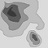
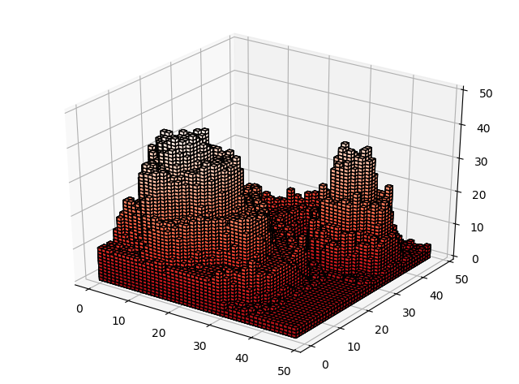

# Voxelated renderings
## Andrew Garcia, 2019

## voxelization.py

A program to map pixelated images / topological maps
to voxelated renderings based on pixel intensities

**Example:**

_mountn.png file 48 x 48 pixels_

</a>

_script output / treatment of mountn.png_

</a>
