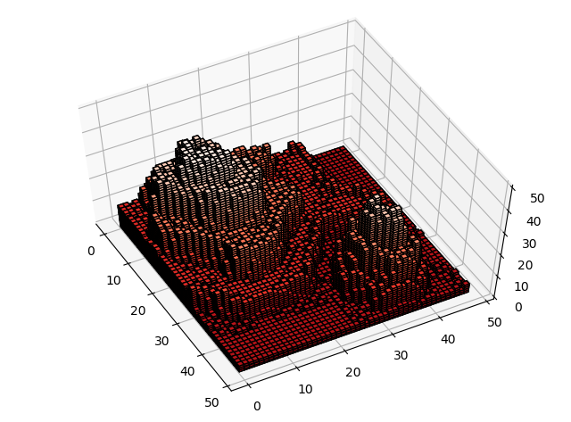

# ANNOUNCEMENT : This project is now deprecated

This project is now deprecated. For a more functional application of this project, please re-direct to [**voxelmaps**](https://github.com/andrewrgarcia/voxelmap) and use the **voxelmaps.Image('yourfilepath.png')** object and its ->make() and ->map3d() functions to map images to 3-D models. 

# Voxelated renderings
## Andrew Garcia, 2019

## voxelization.py

A program to map pixelated images / topological maps
to voxelated renderings based on pixel intensities

### Example:

**mountn.png** file 48 x 48 pixels

</a>

script output / treatment of **mountn.png**

</a></a>
